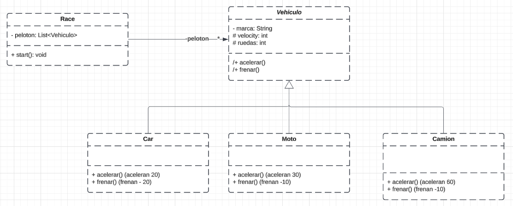

# Carrera #
Este proyecto simula una carrera de vehículos. Aquí he usado conceptos de Programación Orientada a Objetos (OOP) como la Herencia y el Polimorfismo para crear un sistema en el que coches, motos y camiones compartan atributos, pero que cada uno pueda acelerar y frenar uno más rápido, otros más lentos.

## 💡 Conceptos aprendidos ##
### Diagrama UML ###

### Herencia ###
La clase Vehicle es como el pilar donde guardamos las propiedades comunes: marca, velocidad y ruedas. Además de métodos generales como accelerate y brake. A partir de Vehicle, las subclases Car, Motorbike y Truck reutilizan estas características y añaden comportamientos específicos. Así no repetimos código, todo se aprovecha, y el sistema es mucho más ordenado, organizando diferentes tipos de vehículos.

#### Estructura: ####
- Clase principal: Vehicle (propiedades y métodos generales).
- Subclases: Car, Motorbike y Truck (amplían y personalizan la funcionalidad).

### Polimorfismo ###
Con el polimorfismo, podemos tratar cualquier tipo de vehículo igual, aunque cada uno se comporta diferente . Esto permite que cada clase hija (subclase) personalice métodos de manera única. O sea, puedes usar el método accelerate() para todos, pero cada vehículo lo va a hacer a su manera. Esto hace que el código sea más flexible, escalable y no tenga que estar repitiendo cosas.
